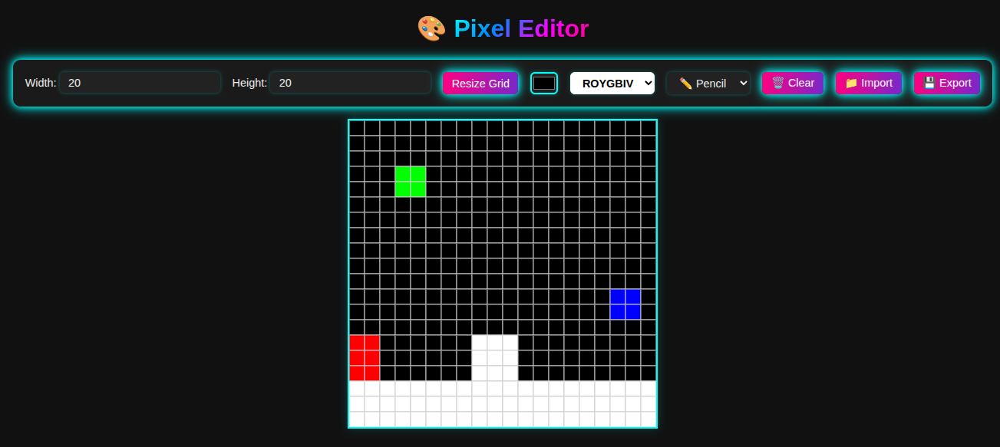

<p align="center">
	
</p>

<h1 align="center">Pixel Editor</h1>

<p align="center">
	<strong>Create pixel art and edit images with a webUI!</strong>
</p>

## 🚀 Overview

Welcome to **Pixel Editor**! This program allows you to create pixel art and edit pre-existing images using a simple web interface. It is designed to be user-friendly and efficient, making it easy for anyone to create pixel art.

## 🎨 Features

- **Cross Platform**: The program is built using Electron, making it compatible with Windows, macOS, and Linux.
- **Dark Theme**: The program features a sleek dark theme that is easy on the eyes and provides a modern look.
- **Image Editing**: You can edit existing images by uploading them to the web interface.
- **Save and Export**: Save your pixel art creations in various formats, including PNG, JPEG, and BMP.
- **Line Drawing**: Draw straight lines by clicking a tile, clicking another tile, and then clicking the first tile again.

## 🛠️ Installation

**Clone the Repository**
```sh
git clone https://github.com/321BadgerCode/pixel_editor.git
cd ./pixel_editor/
```

### 📦 Dependencies

- **Electron**: The program uses [Electron](https://www.electronjs.org/) to create a desktop application with a web interface.
```sh
npm install --save-dev electron
```

## 📈 Usage

**Run the program**
```sh
npm start
```

**Build the program**
```sh
npm run build
```

> [!NOTE]
> The executable will appear in the `dist` folder.

<details>

<summary>How got ROYGBIV hex values?</summary>

To get the hex values for the ROYGBIV colors, Tkinter was used. This was done in order to make it cross-compatible with the level editor for the [Platformer Playground](https://github.com/321BadgerCode/platformer_playground) 2D game.

```py
import tkinter as tk

def rgb16_to_hex(rgb):
	return "#{:02x}{:02x}{:02x}".format(*(v // 256 for v in rgb))

colors = ["red", "orange", "yellow", "green", "blue", "indigo", "violet"]

root = tk.Tk()
root.withdraw()

print("Tkinter ROYGBIV color hex values:")
for color in colors:
	rgb = root.winfo_rgb(color)
	hex_val = rgb16_to_hex(rgb)
	print(f"{color}: {hex_val}")

root.destroy()
```

</details>

## 📸 Screenshots

<p align="center">
	
</p>

## 🤝 Contributing

Contributions are welcome! If you have any suggestions or improvements, feel free to open an issue or submit a pull request.

## 📜 License

[LICENSE](./LICENSE)